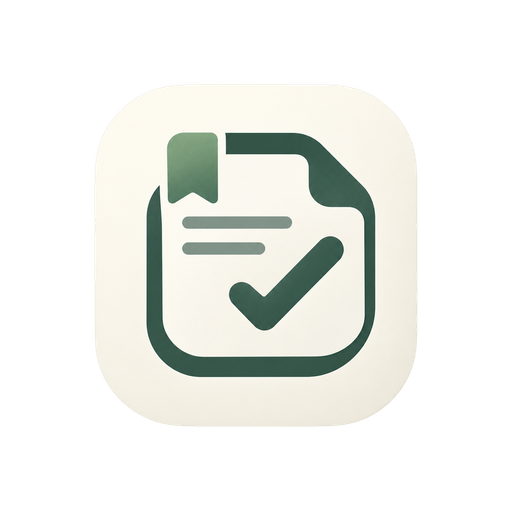
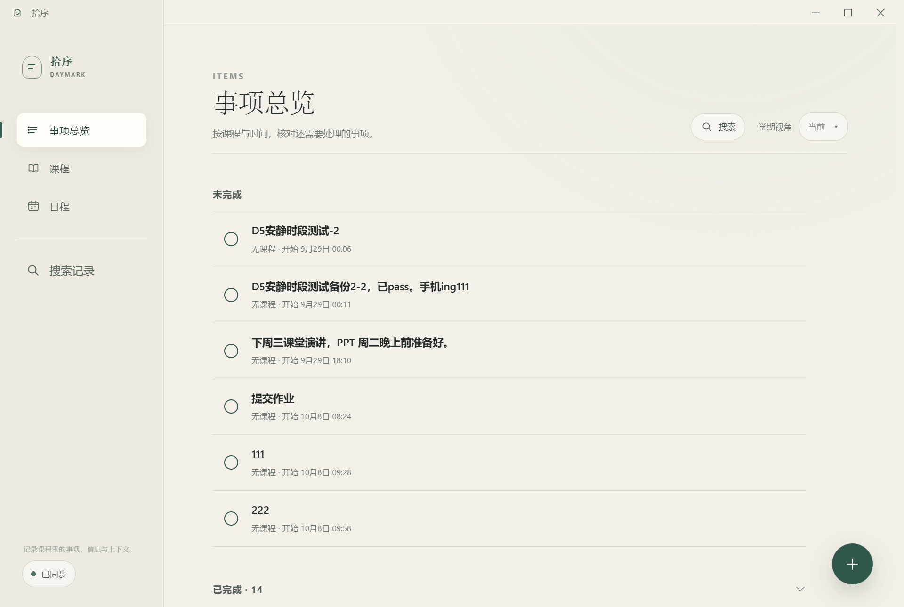
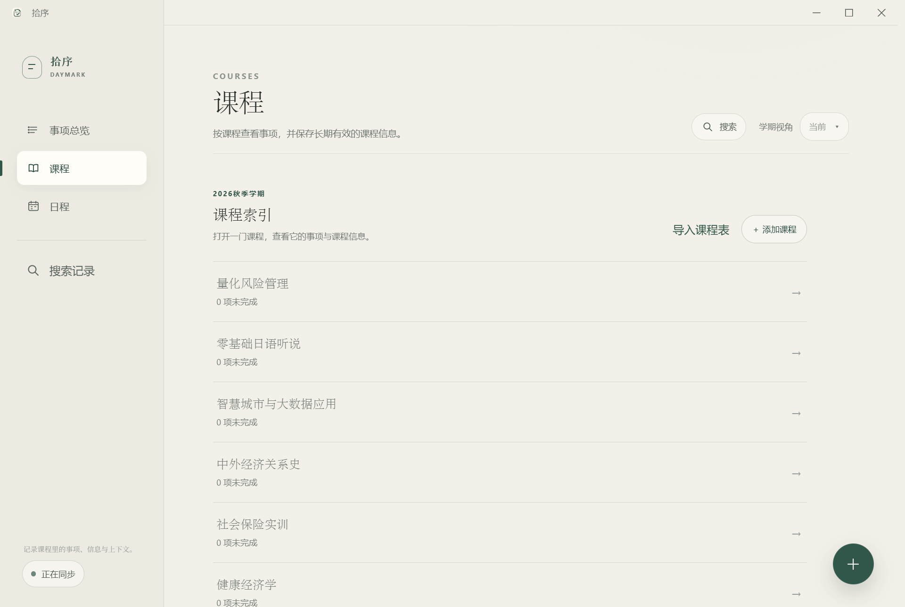
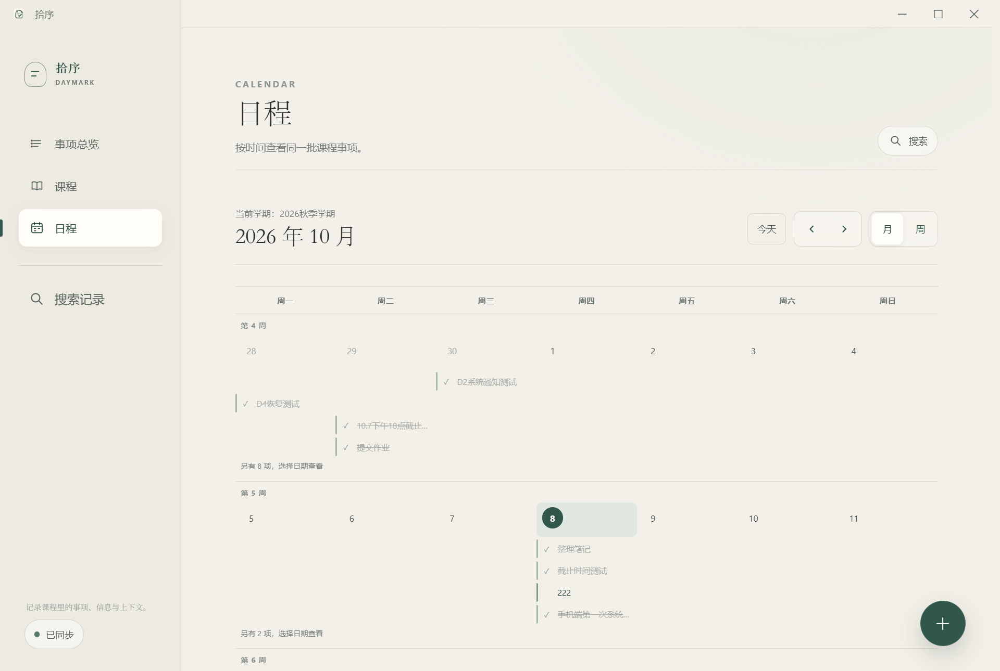

  

<h1 align="center">拾序 Daymark</h1>

  <b>把课程表、事项提醒和课程资料，放进同一个地方。</b> 
  电脑（Windows）和手机（安卓）都能用，数据实时同步。

  

## 为什么做这个

大学生的日常是散的：课表在一张表里、作业在另一个 App、老师群里的一句话转头就找不着。提醒倒是不少——然后被手机系统在后台悄悄清掉。

拾序把这些收拢到一处：

- **课表和事项在一起**——每件事都能挂在具体课程和时间上，打开就知道"这周该干什么"；
- **提醒真的能响**——到点提前量可配置，电脑和手机都会提醒；首次启动会一次性把通知、后台运行这些权限引导好，不让你去翻手机设置；
- **资料带着上下文**——课程资料、笔记和它们对应的课程、时间存在一起，以后搜得到。

## 你能用它做什么

### 📋 事项总览

打开就是"还没做完的事"，按课程和时间排好；做完打勾，已完成自动折叠。右下角 `+` 随手记一条。

### 📅 课程与课表

按学期管理课程；课表可以**直接导入**——丢给它教务处导出的文件或一张课表截图，AI 识别后给你一份**待确认的预览**，你点头才真正入库（不会闷声写错）。

### 🗓 日程日历

月视图 / 周视图切换，按时间看同一批课程事项，截止日期一眼扫完。

### 🔔 可靠的提醒

- 每件事可以设提前量（提前 15 分钟、2 小时、1 天……重要事项档位更多）；
- 电脑、手机**两边都会响**，同一条不重复轰炸；
- 安卓首次启动的权限引导把「通知 / 后台运行 / 到点提醒 / 自启动」一页配齐——这是提醒不被系统吞掉的关键。

### 🔍 全局搜索与多设备同步

任何页面 `Ctrl/⌘+K` 搜全部记录；登录同一账号，电脑记的手机上就有，改动冲突会明明白白列出来让你选，不会悄悄覆盖。

### 🖥 电脑上常驻

最小化到托盘继续跑，关窗口也不会中断提醒；从托盘菜单一键唤回主界面。

## 下载安装

| 平台          | 下载                        | 说明                             |
| ------------- | --------------------------- | -------------------------------- |
| Windows 10/11 | `拾序_x.x.x_x64-setup.exe`  | 双击安装，打开即用               |
| 安卓          | `app-universal-release.apk` | 点开安装（需允许"安装未知应用"） |

**以后升级不用手动**：应用打开时自动检查，有新版会弹出卡片，点「立即更新」完成升级（旧版安卓包需最后手动装一次新版，之后就全自动了）。

从 [Releases](../../releases) 页面获取最新版。

## 数据与隐私

- **本地优先**：不登录也能完整使用，数据存在你自己的设备上；
- **同步由你决定**：登录后才在你的账号下云同步，退出登录不影响本机数据；
- **AI 导入只发它需要的**：课表识别只会把你选中的文件/图片发给识别服务，确认前不入库。

## 这是什么

拾序（Daymark）是一个面向学生个人使用的课程事务工具，持续打磨中。想法、问题欢迎提 [Issues](../../issues)。

开发者与工程细节见仓库内 docs/ 目录。
